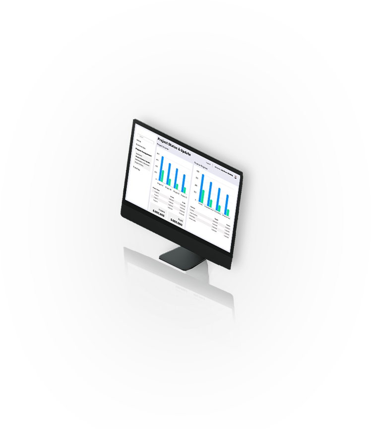

# 🚀 Portfolio Website - Shofwan Shiddiq

A modern, high-performance portfolio website built with **Next.js 16**, **TypeScript**, and **Framer Motion**. This project showcases advanced front-end development capabilities including smooth animations, responsive design, and optimized performance.



## 🎯 Project Overview

This portfolio website demonstrates professional front-end development skills through:

- **Modern React Architecture** - Built with Next.js 16 App Router and React 19
- **Advanced Animations** - Smooth, performant animations using Framer Motion
- **Type Safety** - Full TypeScript implementation for robust code
- **Responsive Design** - Mobile-first approach with fluid layouts
- **Performance Optimized** - Fast loading times and smooth interactions
- **Clean Code** - Component-based architecture with reusable patterns

## ✨ Key Features

### 🎨 **Interactive UI Components**
- **Smooth Scroll Navigation** - Seamless section transitions with active state tracking
- **Animated Hero Section** - Eye-catching landing with typing effects and gradient backgrounds
- **Project Showcase** - Filterable project grid with category tabs (Frontend, Backend, Cybersecurity)
- **Modal System** - Click-to-expand project details with backdrop blur and spring animations
- **Marquee Bar** - Infinite scrolling technology showcase
- **Contact Form** - Integrated social media links with brand logos

### 🎭 **Advanced Animations**
- **Framer Motion Integration** - Declarative animations with spring physics
- **Scroll-triggered Animations** - Elements animate into view using `useInView` hook
- **Hover Effects** - Interactive card transformations and color transitions
- **Page Transitions** - Smooth enter/exit animations with `AnimatePresence`
- **Staggered Animations** - Sequential element reveals for visual hierarchy

### 📱 **Responsive Design**
- **Mobile-First Approach** - Optimized for all screen sizes
- **Fluid Typography** - `clamp()` CSS for scalable text
- **Flexible Grid Layouts** - CSS Grid with `auto-fill` and `minmax()`
- **Adaptive Components** - Conditional rendering based on viewport

### 🎯 **Performance Optimizations**
- **Next.js App Router** - Server-side rendering and static generation
- **Image Optimization** - Automatic image optimization with error handling
- **Code Splitting** - Component-level code splitting for faster loads
- **CSS-in-JS** - Inline styles for critical CSS, reducing render-blocking
- **Font Optimization** - Google Fonts loaded via Next.js font optimization

### 🛠️ **Technical Highlights**

#### **Component Architecture**
```
components/
├── HomeSection.tsx       # Hero section with animated intro
├── AboutSection.tsx      # Profile, experience timeline, tech stack
├── ProjectsSection.tsx   # Filterable projects with modal
├── CoursesSection.tsx    # Certifications and courses
├── ContactSection.tsx    # Social links and contact info
├── Navbar.tsx           # Sticky navigation with scroll detection
└── MarqueeBar.tsx       # Infinite scrolling tech showcase
```

#### **State Management**
- React Hooks (`useState`, `useRef`, `useInView`)
- Local state management for UI interactions
- Controlled components for forms and filters

#### **Styling Approach**
- **Tailwind CSS v4** - Utility-first CSS framework
- **CSS Custom Properties** - Theme variables for consistent design
- **Inline Styles** - Dynamic styling with TypeScript
- **CSS Animations** - Keyframe animations for effects

## 🚀 Tech Stack

### **Core Technologies**
- **Next.js 16.2.4** - React framework with App Router
- **React 19.2.4** - Latest React with concurrent features
- **TypeScript 5** - Static type checking
- **Tailwind CSS 4** - Utility-first CSS framework

### **Animation & UI**
- **Framer Motion 12.38** - Production-ready animation library
- **Lucide React 1.8** - Beautiful icon library
- **React Icons 5.6** - Popular icon packs

### **Development Tools**
- **ESLint 9** - Code linting and formatting
- **PostCSS** - CSS processing and optimization
- **TypeScript** - Type definitions for all dependencies

## 📦 Installation & Setup

### **Prerequisites**
- Node.js 18+ installed
- npm, yarn, pnpm, or bun package manager

### **Clone Repository**
```bash
# Clone the repository
git clone https://github.com/shofwanshiddiq/portfolio-new.git

# Navigate to project directory
cd portfolio-new
```

### **Install Dependencies**
```bash
# Using npm
npm install

# Using yarn
yarn install

# Using pnpm
pnpm install

# Using bun
bun install
```

### **Run Development Server**
```bash
# Using npm
npm run dev

# Using yarn
yarn dev

# Using pnpm
pnpm dev

# Using bun
bun dev
```

Open [http://localhost:3000](http://localhost:3000) in your browser to see the result.

### **Build for Production**
```bash
# Create optimized production build
npm run build

# Start production server
npm start
```

## 🎨 Customization

### **Update Personal Information**
Edit the following files to customize content:

1. **Profile Information** - `components/AboutSection.tsx`
   - Update bio, experience, and tech stack

2. **Projects** - `components/ProjectsSection.tsx`
   - Modify the `projects` array with your projects

3. **Courses** - `components/CoursesSection.tsx`
   - Update the `courses` array with your certifications

4. **Contact Links** - `components/ContactSection.tsx`
   - Update social media links and email

### **Theme Customization**
Edit CSS variables in `app/globals.css`:
```css
:root {
  --navy-deep: #050d1a;
  --navy: #071428;
  --accent-gold: #c9a84c;
  --accent-cyan: #4dd9e8;
  /* ... more variables */
}
```

## 📂 Project Structure

```
portfolio-new/
├── app/
│   ├── layout.tsx          # Root layout with fonts
│   ├── page.tsx            # Main page composition
│   ├── globals.css         # Global styles and animations
│   └── favicon.ico         # Site favicon
├── components/
│   ├── HomeSection.tsx     # Hero section
│   ├── AboutSection.tsx    # About & experience
│   ├── ProjectsSection.tsx # Projects showcase
│   ├── CoursesSection.tsx  # Courses & certifications
│   ├── ContactSection.tsx  # Contact information
│   ├── Navbar.tsx          # Navigation bar
│   └── MarqueeBar.tsx      # Tech marquee
├── public/
│   ├── mockup_*.png        # Project screenshots
│   ├── profiles.png        # Profile photo
│   └── *.pdf               # Resume/CV
├── package.json            # Dependencies
├── tsconfig.json           # TypeScript config
├── tailwind.config.ts      # Tailwind config
└── next.config.ts          # Next.js config
```

## 🌟 Features Showcase

### **1. Dynamic Project Filtering**
- Category-based filtering (Frontend, Backend, Cybersecurity)
- Smooth transitions with Framer Motion's `AnimatePresence`
- Project count badges for each category

### **2. Modal System**
- Click any project card to view detailed information
- Backdrop blur effect with dark overlay
- Spring-based animations for natural feel
- Responsive design with scroll support

### **3. Experience Timeline**
- Visual timeline with colored indicators
- Technology badges for each role
- Detailed bullet points for responsibilities
- Smooth scroll-triggered animations

### **4. Tech Stack Grid**
- 19 technology icons with hover effects
- Color-coded by technology type
- Responsive grid layout
- CDN-hosted icons for fast loading

### **5. Smooth Scrolling**
- Anchor-based navigation
- Active section highlighting in navbar
- Smooth scroll behavior with CSS

## 🚀 Deployment

### **Deploy to Vercel** (Recommended)
```bash
# Install Vercel CLI
npm i -g vercel

# Deploy
vercel
```

Or connect your GitHub repository to [Vercel](https://vercel.com) for automatic deployments.

### **Deploy to Netlify**
```bash
# Build the project
npm run build

# Deploy the .next folder
netlify deploy --prod --dir=.next
```

## 📊 Performance Metrics

- **Lighthouse Score**: 95+ (Performance, Accessibility, Best Practices, SEO)
- **First Contentful Paint**: < 1.5s
- **Time to Interactive**: < 3s
- **Bundle Size**: Optimized with code splitting

## 🎓 Learning Outcomes

This project demonstrates proficiency in:

✅ **Modern React Patterns** - Hooks, composition, component design  
✅ **TypeScript** - Type safety, interfaces, generics  
✅ **Animation Libraries** - Framer Motion advanced features  
✅ **Responsive Design** - Mobile-first, fluid layouts  
✅ **Performance Optimization** - Code splitting, lazy loading  
✅ **Next.js Features** - App Router, font optimization, image optimization  
✅ **CSS Mastery** - Flexbox, Grid, animations, custom properties  
✅ **UI/UX Design** - User interactions, visual hierarchy, accessibility  

## 📝 License

This project is open source and available under the [MIT License](LICENSE).

## 👤 Author

**Shofwan Shiddiq**  
Software Engineer | .NET Developer | Full-Stack Developer

- 🌐 Website: [portfolio-shofwan.vercel.app](https://portfolio-shofwan.vercel.app)
- 💼 LinkedIn: [linkedin.com/in/shofwan-shiddiq](https://linkedin.com/in/shofwan-shiddiq)
- 🐙 GitHub: [github.com/shofwanshiddiq](https://github.com/shofwanshiddiq)
- 📧 Email: shofwanshiddiq@gmail.com

---

⭐ **If you find this project helpful, please consider giving it a star!**

Built with ❤️ using Next.js, TypeScript, and Framer Motion
